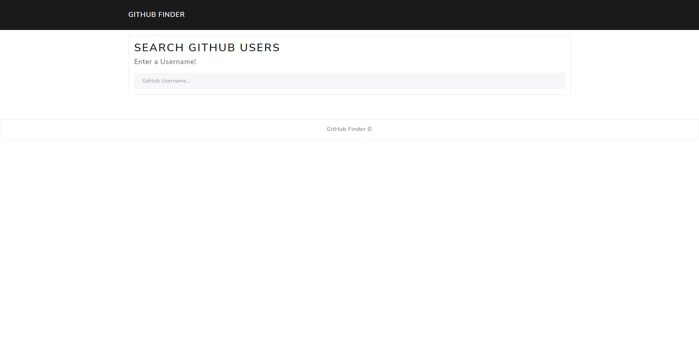

# Github-Finder

EasyWeather is a web application that uses the GitHub Api to find the Github user you are looking for. 

It provides basic information about user, the last public repos of the user, the public Gists, the followers and the following.

For the design we are using bootstrap.

## Installation
The application is written in native JavaScript HTML and CSS, the installation of bootstrap is required. 

## Usage

Input the Username of the User you want to find and voila!

